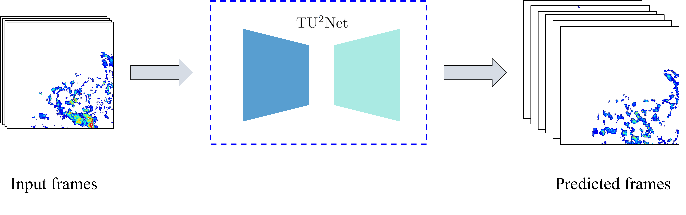
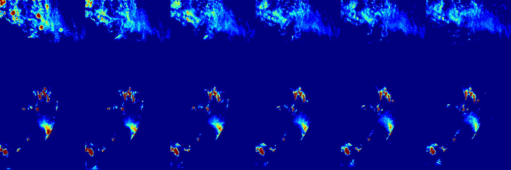
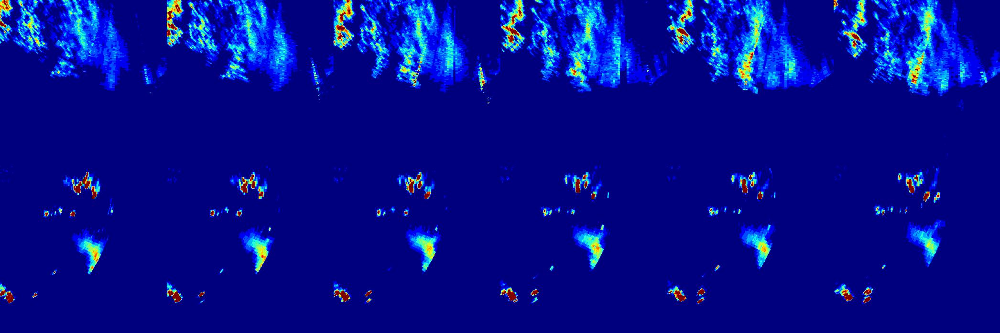
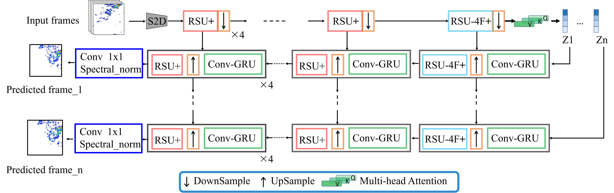
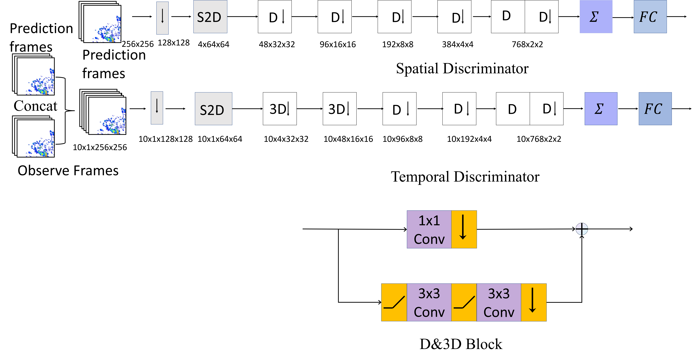

# TU<sup>2</sup>Net a temporal precipitation noewcasting with multiple decoding modules


<p center>

</>


# Visual Sample Result  
sample
<p align="center">
  
</p>
lable
<p align="center">
  
</p>


This is a PyTorch implementation of the TU$^2$Net


# How to use ?
``` bash
pip install -r requirements.txt
```
```
cd tu2net
```
```
python smaple.py 
```


# Train Set
| NET| optim | lr |betas|
|-------|-------|-------|-------|
|  TU<sup>2</sup>Net| Adam | 2e-4 |(0.0, 0.999)|
|   Temporal Discriminator   | Adam | 2e-5  |(0.0, 0.999)|
|  Spatial Discriminator  |Adam|2e-5|(0.0, 0.999)|


## Generator
<p align="center">
  
</p>

You can find Generator from TU2Net.py
```python
from TU2Net import Generator_full
device = "cuda"
Generator = Generator_full(device=device)
```

## Discriminators
<p align="center">
  
</p>

You can find Discriminator from Discriminator.py
```python
from Discriminator import Temporal,Spatial
device = "cuda:0"
Temporal_net = Temporal().to(device)
Spatial_net = Spatial().to(device)
```

## loss function
> We provide several loss functions in losses.py, including some common reconstruction losses.
```
from losses import Generator_loss_reconstruction_with_resnet34,Generator_loss_skillful,DiscriminatorLoss_hinge
x = torch.rand(size=(4,6,1,256,256))
y = torch.rand(size=(4,6,1,256,256))

g_resnet = Generator_loss_reconstruction_with_resnet34()

print(g_resnet(x,y,torch.tensor(1.0)))


DiscriminatorLoss_hinge(dis_real_out,True)
DiscriminatorLoss_hinge(dis_pre_out,False)
```


# Citations


# TODO
- [x] Create  Generator model
- [x] Complete the image generation script 
- [x] Organize the completed discriminator script
- [x] Organize the completed loss function script
- [ ] Create training script